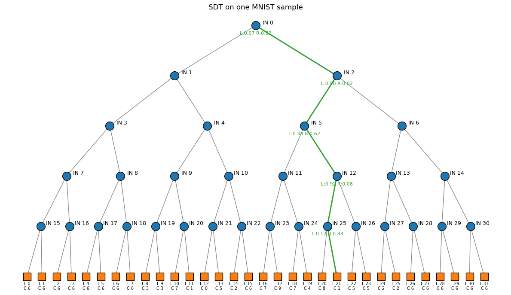
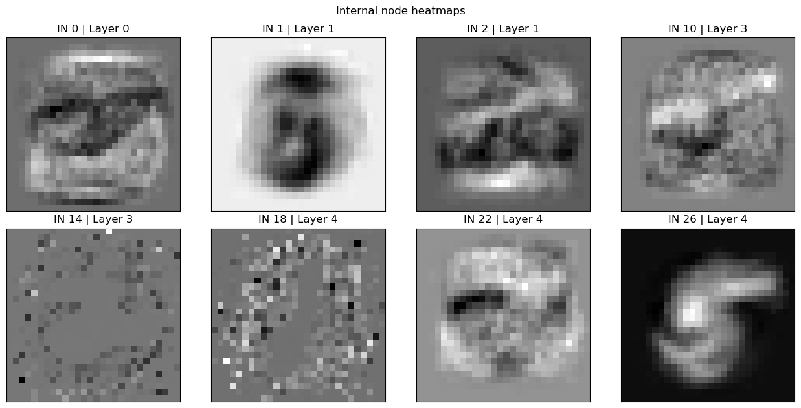
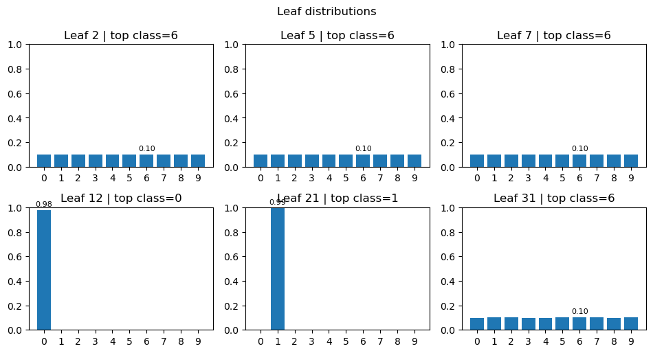

# Soft Decision Tree (SDT)

A up-to-date implementation of a Soft Decision Tree (SDT) based on PyTorch. "inv_temp", "hard_leaf_inference", "left-right balance regularization" and Visualization implemented.

It includes example code for classification and visualization on the MNIST handwritten digits dataset. Verified on PyTorch 2.3.

Original paper: "Distilling a Neural Network Into a Soft Decision Tree" — https://arxiv.org/abs/1711.09784

Chinese documentation and Notebooks are available in the `Chinese_Documentation/` folder.

Soft Decision Tree illustration and decision process:


## About the SDT module

This section documents the SDT class implemented in `SDT_pt.py`. Key model parameters:
- `depth`: Depth of the tree
- `lamda`: Regularization coefficient
- `inv_temp`: Inverse temperature, controlling the hardness of decisions. Referencing the temperature parameter from knowledge distillation; the default is 1.0 (i.e., no temperature scaling).
- `hard_leaf_inference`: Whether to use a hard leaf during inference
	- When set to True, the model selects the leaf on the most probable path as the output during inference, making the decision more explicit and interpretable.
	- When set to False, the model considers the probability distribution over all leaves.
	- The original paper suggests setting this to **True** if you want a clearer decision path (i.e., higher interpretability), at the potential cost of some accuracy.
	- For details, see the paper: "This model can be used to give a predictive distribution over classes in two
                        different ways, namely by using the distribution from the leaf with the greatest
                        path probability or averaging the distributions over all the leaves, weighted by
                        their respective path probabilities. ... "
- `use_penalty_ema`: Whether to use EMA (Exponential Moving Average) smoothing to adjust the regularization
- `penalty_ema_beta`: The decay factor for the EMA smoothing
	- The idea of these two parameters: add a "left-right balance" regularization term to each internal node to prevent routing almost all samples to one side, which can cause vanishing gradients and early saturation.
	- The paper notes: "... we can maintain an exponentially decaying running
				average of the actual probabilities with a time window that is
				exponentially proportional to the depth of the node."
	- Enable `use_penalty_ema` to obtain smoother regularization.
- `use_cuda`: Whether to use GPU. In our tests, CPU training is actually faster.

## Project structure

```
Soft_Decision_Tree_implement/
├─ 1_Soft_Desicion_Tree_on_MNIST.ipynb     # Training and saving
├─ 2_Load_Model_and_Visuallization.ipynb   # Loading and visualization
├─ Chinese_Documentation/                  # Chinese docs
├─ SDT_pt.py                               # PyTorch implementation of SDT
├─ checkpoints/
│  └─ sdt_mnist.pt                         # Pretrained weights (example)
├─ train_losses_epoch_40.txt               # Training loss log (example)
└─ test_accuracies_epoch_40.txt            # Test accuracy log (example)
```

## Environment

- Python 3.10+ (recommended)
- Main dependencies:
	- torch, torchvision (tested with PyTorch 2.3)
	- matplotlib, numpy, jupyter

CPU-only PyTorch is sufficient for training and inference of SDT (GPU acceleration may actually slow it down).

## Quick start

### 1) Train and save the model

Open and run `1_Soft_Desicion_Tree_on_MNIST.ipynb` step by step:
- Download MNIST and create DataLoaders
- Build the SDT (see the notebook for parameter descriptions)
- Train for several epochs (40 by default; adjust as needed)
- Save checkpoints

### 2) Load and visualize
Open and run `2_Load_Model_and_Visuallization.ipynb` step by step:
- Restore the model and optimizer from checkpoints
- Do a quick accuracy check on a test batch
- Visualizations (feel free to customize):
	- The decision tree and the best decision path for a single sample
	- Internal-node weight heatmaps (heatmap/heatvector)
	- Leaf-node class probability distributions (bar charts)

Note: To plot the "best path", set `hard_leaf_inference=True` when constructing the model (enabled by default in the notebook).

### About the visualization

For SDT, each *inner node* learns a weight vector $W$ over the input features (same length as the input features) and a bias term $b$. By visualizing the internal-node $W$, we can understand the SDT's decision process—for example, which feature dimensions have higher weights and thus influence the decision more.

Additionally, *leaf nodes*, as the end of a decision path, learn the class probability distributions.

The notebook provides a `visualize_sdt` function to visualize the SDT's decision process on a particular sample. It plots the decision tree and returns a dictionary `info` with node parameters:
- depth: depth of the tree
- internal_nodes (node info): list[ {index, layer, W (Tensor), b (float)} ]
- leaves (leaf info): list[ {index, class_logits (Tensor), class_probs (Tensor)} ]

---

Examples:





## References and acknowledgements

- Original paper: "Distilling a Neural Network Into a Soft Decision Tree" — https://arxiv.org/abs/1711.09784
- GitHub project: https://github.com/kimhc6028/soft-decision-tree
